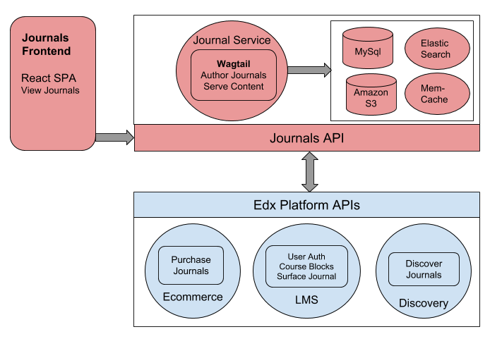

journals  |Travis|_ |Codecov|_
===================================================
.. |Travis| image:: https://travis-ci.org/edx/journals.svg?branch=master
.. _Travis: https://travis-ci.org/edx/journals

.. |Codecov| image:: http://codecov.io/github/edx/journals/coverage.svg?branch=master
.. _Codecov: http://codecov.io/github/edx/journals?branch=master

The Journal service is a standalone IDA that provides functionality to create, author, search and deploy Content Journals. 
A Content Journal is a topical, updatable, searchable, purchasable, "Non-Course" like collection of content (html, images, videos, documents) served up through an intuitive web front-end. 
It utilizes the `Wagtail CMS <https://wagtail.io/>`_ for authoring and `Elasticsearch <https://www.elastic.co/products/elasticsearch>`_ for full-text content search, including rich text, PDF's and Video transcripts. 

Journal service is intended to be used in conjunction with the `Journals Frontend React App <https://github.com/edx/journals-frontend/>`_ and is fully integrated with the edx platform to be discoverable in LMS, purchasable in ecommerce and marketable in discovery.
It also exposes a set of Rest-APIs that are used by these other services.

The following is a high level diagram of the Journals architecture:

License
-------

The code in this repository is licensed under version 3 of the AGPL unless otherwise noted. Please see the LICENSE_ file for details.

.. _LICENSE: https://github.com/edx/journals/blob/master/LICENSE

How To Contribute
-----------------

Contributions are welcome. Please read `How To Contribute <https://github.com/edx/edx-platform/blob/master/CONTRIBUTING.rst>`_ for details. Even though it was written with ``edx-platform`` in mind, these guidelines should be followed for Open edX code in general.

Reporting Security Issues
-------------------------

Please do not report security issues in public. Please email security@edx.org.

Getting Started
---------------
Journal service and frontend currently run in their own independent docker environments. 
Initial Journal setup and user authentication depends on a working independent edx-platform docker environment as the docker environments all communciate with each other.
In the future, features may be added to journals such that it doesn't require edx-platform at all and can run standalone.

Configure edx-platform
~~~~~~~~~~~~~~~~~~~~~~~~~~
1. Get edx-platform docker devstack up and running
   
-  ``git clone https://github.com/edx/devstack.git``
-  Then follow instructions found here to configure: https://github.com/edx/devstack/blob/master/README.rst
-  Start devstack ``make dev.up``

2. Login to LMS as admin

- Go to http://localhost:18000, login with user: edx@example.com and password: edx

3. Configure LMS for Journal Integration via django-admin

- add waffle switch at http://localhost:18000/admin/waffle/switch/add/
    - name: ``journals.enable_journal_integration`` and set to active
    - Active: True
- add catalog integration: http://localhost:18000/admin/catalog/catalogintegration/add/
    - Enabled: True
    - Internal API URL: https://localhost:18381/api/v1
- add the following to Site Configuration for ``example.com`` at http://localhost:18000/admin/site_configuration/siteconfiguration/1/change/

::

    {
    "COURSE_CATALOG_API_URL":"http://edx.devstack.discovery:18381/api/v1/",
    "COURSE_CATALOG_URL_BASE":"http://edx.devstack.discovery:18381",
    "JOURNALS_ENABLED":true,
    "JOURNALS_FRONTEND_URL":"http://localhost:1991"
    }

Configure Journal Service
~~~~~~~~~~~~~~~~~~~~~~~~~~
1. Run ``git clone https://github.com/edx/journals; cd journals``

2. Run ``make dev.destroy`` to destroy any previous setup and start from scratch

3. Run ``make dev.provision`` to setup all necessary configuration in Journals, LMS, ecommerce and discovery and setup "Demo Journal"

4. Run ``docker-compose ps`` and verify output looks similar to below:

::

            Name                       Command               State                    Ports                 
    ---------------------------------------------------------------------------------------------------------
    journals.app             bash -c while true; do pyt ...   Up      0.0.0.0:13876->13876/tcp,              
                                                                    0.0.0.0:18606->18606/tcp               
    journals.elasticsearch   /docker-entrypoint.sh elas ...   Up      9200/tcp, 9300/tcp                     
    journals.mysql           docker-entrypoint.sh mysqld      Up      3306/tcp     

5. Access Journal editor by going to http://localhost:18606/cms. This displays Journal Editor UI where you can create and edit Journals.

Configure Journals Frontend
~~~~~~~~~~~~~~~~~~~~~~~~~~~~
1. Run ``git clone https://github.com/edx/journals-frontend; cd journals-frontend``

2. Run ``make up``

3. Verify Journal Frontend is running by going to http://localhost:1991. You should see about page for “Demo Journal”.

4. To edit the Demo Journal, select the "Journal Editor" option from the "Account" button at top right of screen, or directly visit http://localhost:18606/cms.
